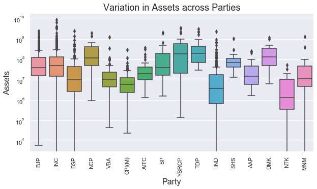
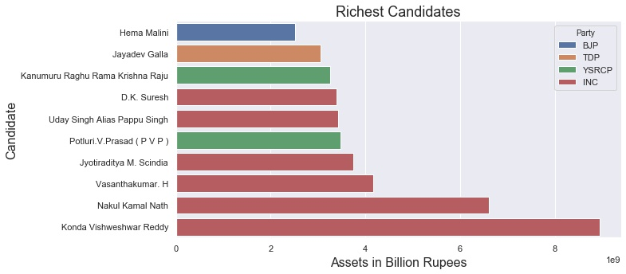
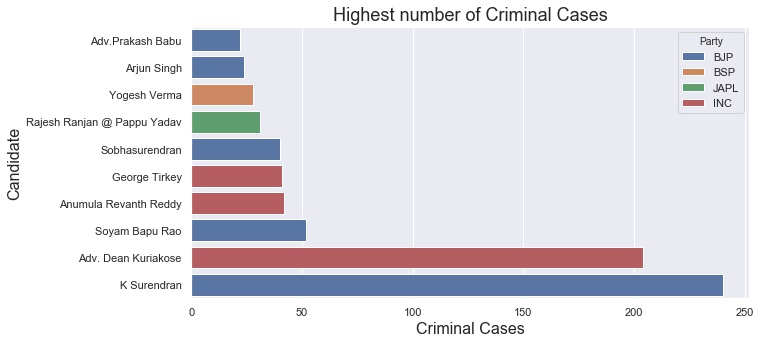

# PolViz
Visualizing trends and variation across candidates for Lok Sabha Elections 2019 in terms of assets owned and criminal cases filed against them.

## Data
Data for Lok Sabha 2019 candidates was sourced from a public dataset on Kaggle [Indian Candidates for General Election 2019](https://www.kaggle.com/prakrutchauhan/indian-candidates-for-general-election-2019).

`shp` file for Indian Political Map was taken from github repository [datameet](https://github.com/datameet/maps).

## Requirements 
* numpy
* pandas
* seaborn
* matplotlib
* geopandas
* shapely

Installing geopandas for Ubuntu is quite straight forward but Windows users may face some issues. Try 
[this](https://stackoverflow.com/questions/56958421/pip-install-geopandas-on-windows) StackOverflow question for installing on Windows.

## Some Interesting Observations

 
